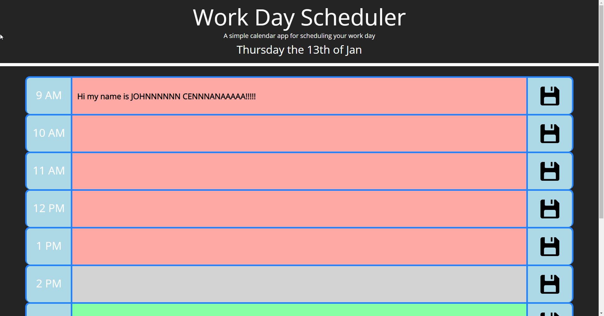

# Homework Week 5 Day Planner Michael Ariti

## Day Planner

The purpose of this repository is to create a single day planner that is updated based on the users inputs, not window refreshes.

## Features

1. 10 Time slots to add activities
2. Dynamic backgrounds that change depending ont he real time, red for past, grey for present, green for future.
3. The ability to save your activites with save buttons.
4. Activities are stored locally so will not be wiped on refresh, provided user has manually saved them
5. Dynamic day updating at the top of the page stating the weekday and date
6. Dynamic refresh occuring at midnight every night purging the localStorage.

## File Directory

You will find the index.html next to this readme, which is the finished website code.

In the assets folder you will find 
1. The guidelines to this homework
2. The css style sheet for the index.html
3. The screenshot of the finished website which is pictured below.
4. The javascript used to run the planner
5. Assets used in the planner buttons

## Secreenshot

## Webpage URL
[Day-Planner-URL](https://michaelfellas.github.io/Daily-Planner)
### End

Michael Ariti 2021
